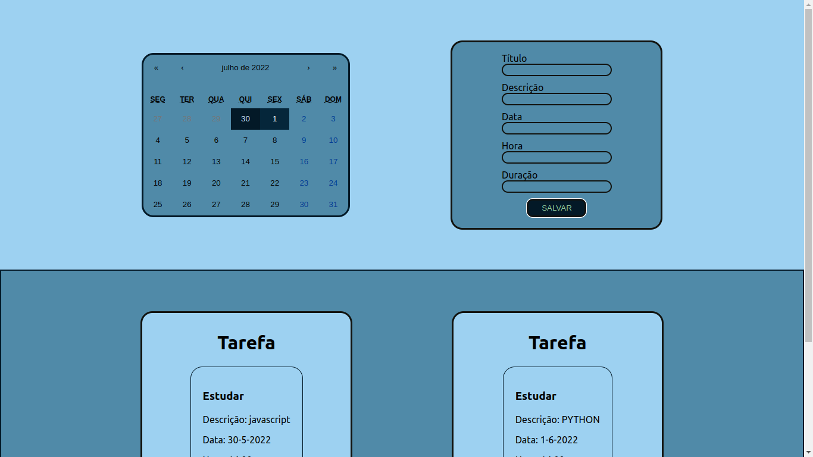
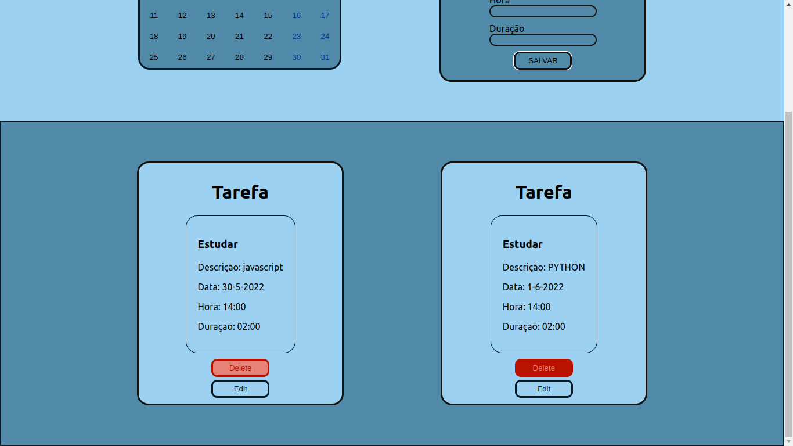

# Calendar ToDoList
Aplicação de uma lista de tarefas com calendário.

---




---

## Sobre o Projeto
Neste projeto foi desenvolvido uma aplicação _Single Page_ de um calendário de tarefas, com as seguintes funcionalidades:
    <ul>
        <li>Exibe um calendário onde é possivel selecionar uma data para adicionar uma nova tarefa</li>
        <li>Cadastra uma nova tarefa no banco de dados</li>
        <li>Edita uma tarefa</li>
        <li>Exclui tarefas selecionadas</li>
    </ul>

## Stacks utilizadas
<ul>
    <li>Banco de Dados MongoDB</li>
    <li>Docker</li>
    <li>ESLint</li>
    <li>Node.js e Express.js</li>
    <li>Teste unitário com Chai e Mocha</li>
    <li>Arquitetura MSC</li>
    <li>Biblioteca react-calendar</li>
    <li>React.js</li>
    <li>HTML</li>
    <li>CSS</li>
</ul>

## Como executar o projeto
Para instalar e executar o calendário de tarefas você deve ter o [Git](https://gist.github.com/derhuerst/1b15ff4652a867391f03) e o [Docker](https://docs.docker.com/install/) instalados e configurados.
Utilizando o terminal, faça o clone do projeto:
```
$ git clone git@github.com:AlineCarolina/Diel-Challenge.git
$ cd DielChallenge
```
Use o Docker para carregar e depois disponibilizar todos os serviços necessários ao funcionamento:
```
$ docker-compose up
```
Para executar os testes:
```
$ cd backend
$ npm test
```

## Considerações Finais
Este projeto continua em desenvolvimeto e novas funcionalidades serão adicionadas em breve, como: mudar forma de vizualização do calendário, vizualizar tarefa no dia do calendário, etc.
